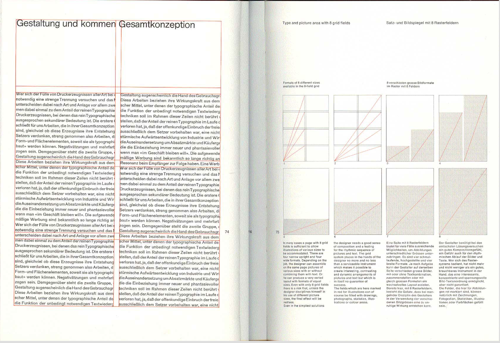
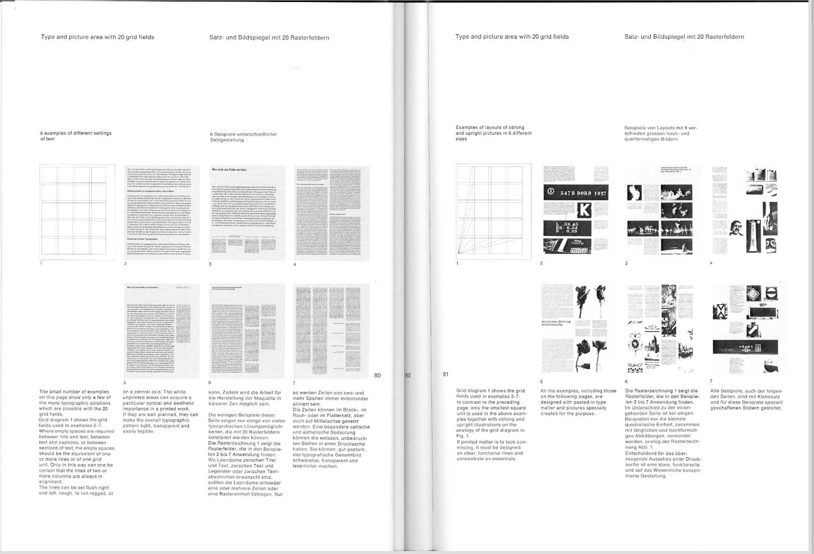

---
title: 'The Grid'
lab: false
studio: true
week_posted: 3
---  

Notes from <a href="https://www.amazon.com/Grid-Systems-Graphic-Design-Communication/dp/3721201450">Grid Systems in Graphic Design</a>, by <a href="http://www.designishistory.com/1940/joseph-mueller-brockmann/">Josef Muller-Brockmann</a>

### Intro

- The grid is used the typographer, graphic designer, photographer and exhibition design for solving visual problems in two and three dimensions.

- By arranging the surfaces and spaces in the form of a grid the designer is favorably placed to dispose his texts, photographs and diagrams in conformity objective and functional criteria

- The reduction of the number of visual elements used and their incorporation in a grid system creates a sense of compact planning

- Information presented with clear and logistically set out tiles, subtitles, texts, illustrations and captions will not only be read more quickly and easily but the information will also be better understood and retained in the memory. This is a scientifically proven fact and the designer should keep it constantly in mind.

### Exercise:

Take a normal printer sheet of paper. Now fold it once to produce half sheet. Then fold it again crisply. Do that again.

Open up your paper and run a pen or pencil on the lines you just marked. That is your first grid.

### Columns

 

- The question of column width is not merely one of design or of format; the question of legibility is of equal importance. The reader should be able to read the message of a text easily and comfortably

- This depends to a not inconsiderable extends on the size of the type, the length of the lines, and the leading.

- According to a well–known empirical rule there should be 7 words per line for a text of any length. If we want to have 7 - 10 words per line, the length of the line can be readily calculated

- so to keep the type area light and open in appearance, we have to determine the learning i.e. the vertical distance from line to line spot that it suits the size of the type

- To choose a width of column which make the text pleasant to read is one of the most important typographic problems

- The width of the columns must be proportioned to the size of the type. Overlong column are wearying on the ee and also have an adverse psychological effect. Overshort columns can also be disturbing because they interrupt the flow of reading and put the reader off by obliging to change the line too rapidly.

### Leading

- Leading is an important factor in deciding whether a particular width of column will be pleasant to read … Just as the distances between letters and words can be too great, so too much or too little leading can adversely affect the optical picture of the typography, discourage the reader and, consciously or unconsciously , set up psychological barriers. Too open a pattern distant the cohesion of the text, the lines appear isolated and figure as independent elements. The print looks dead and lacking in design, the reading speed is slowed down unless new motivating factors are operative.

- A similar negative effect can also be produced by composition which the lines are set too close together. The type appears too dark, the lines forfeit their optical clarity and restfulness. The eye is overtaxed and incapable of reading the individual lines with our path the same time "doubling", i.e. reading the processing and succeeding lines

- The problem of finding the leading which is right in every respect and the problem o finding a column width which is appropriate to the size of the typeface employed area explained here because they are very closely connected with grid design.

### Margin Proportions

- The type area is invariably surrounded by an a marginal zone. For one thing, there are technical reasons: as a rule discrepancies of between 1 and 3 mm and often as much as 5mm occur when the pages trimmed. Without a proper margin the text itself might be mutilated. For another, there are aesthetic reasons. A well–proportioned margin can enhance the pleasure of reading enormously. All the famous typographic works of previous centuries have marginal proportions which have been carefully calculated using the [Golden Section](http://www.tokenrock.com/explain-golden-ratio-177.html) or some other mathematical formula.

- A sensitive designer will always do his best to create the maximum  tension in the proportion he chooses for his margins

### Making the grid

> The problem posed by the job must be studied before work can begin

_I repeat!_

> The problem posed by the job must be studied before work can begin

In a sophisticated grid system not only the lines of text align with the pictures but also the captions and the display letter, titles and subtitles

*See more in walkthrough on p. 61 - 63*

The rest of the book covers various (print based) examples.

Feel free to explore independently.

↪ <a href="https://monoskop.org/File:Mueller-Brockmann_Josef_Grid_Systems_in_Graphic_Design_Raster_Systeme_fuer_die_Visuele_Gestaltung_English_German_no_OCR.pdf">Download PDF</a>
